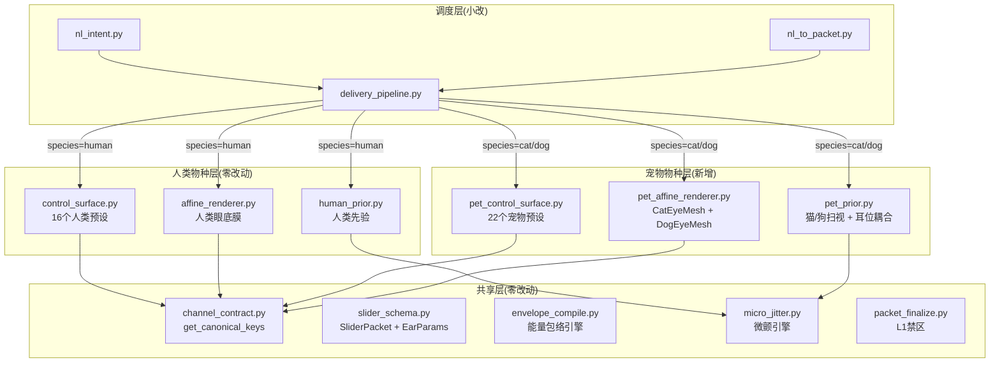
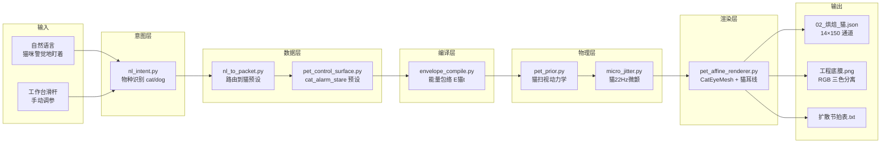

# 宠物版 · 文件结构规划方案

> 目标：在**不破坏现有人类管线**的前提下，以**最小新增文件**支持猫/狗管线
> 核心原则：共享逻辑零复制，物种差异零耦合

---

## 一、总体结构鸟瞰

```
jintao_node_eye/
├── AI_INDEX.md
├── __init__.py
│
├── gaze_engine/               ← 核心引擎（新增 3 个 pet_*.py）
│   ├── __init__.py
│   │
│   ├── [共享模块] — 零改动
│   │   ├── slider_schema.py       ← 小改：+species 字段 + EarParams
│   │   ├── channel_contract.py    ← 小改：+get_canonical_keys(species)
│   │   ├── envelope_compile.py    ← 不动（接收外部 PAD 权重）
│   │   ├── micro_jitter.py        ← 不动（频率参数由外部传入）
│   │   ├── pipeline_io.py         ← 不动
│   │   ├── workbench_io.py        ← 不动
│   │   ├── workbench_context.py   ← 不动
│   │   ├── packet_finalize.py     ← 不动
│   │   ├── export_diffusion_metronome.py ← 不动
│   │   ├── batch_presets.py       ← 不动
│   │   ├── node1_defaults.py      ← 不动
│   │   ├── llm_openai.py          ← 不动
│   │   └── audio_compiler.py      ← 不动（禁用中）
│   │
│   ├── [人类模块] — 零改动
│   │   ├── control_surface.py     ← 不动
│   │   ├── affine_renderer.py     ← 不动
│   │   ├── human_prior.py         ← 不动
│   │   ├── pulse_quality.py       ← 不动
│   │   ├── persona_compiler.py    ← 不动
│   │   └── persona_matrix.json    ← 不动
│   │
│   ├── [新增 3 个宠物文件]
│   │   ├── pet_control_surface.py ← 猫/狗 22 个情绪预设
│   │   ├── pet_affine_renderer.py ← CatEyeMesh + DogEyeMesh + 耳位渲染
│   │   └── pet_prior.py          ← 猫/狗扫视 + 耳位耦合 + 第三眼睑
│   │
│   ├── [管线调度] — 小改
│   │   ├── delivery_pipeline.py  ← 小改：species 分支路由
│   │   ├── nl_intent.py          ← 小改：物种关键词识别
│   │   └── nl_to_packet.py       ← 小改：物种路由
│   │
│   └── test_persona_integrity.py ← 不动
│
├── eye_asset/                  ← 新增宠物视觉资产目录
│   ├── derived/                ← 人类资产（不动）
│   ├── cat/                    ← 新增：猫底图 + 耳位数据
│   │   ├── eyelid_cat_raw.png
│   │   └── ear_positions_cat.json
│   └── dog/                    ← 新增：狗底图 + 耳位数据
│       ├── eyelid_dog_raw.png
│       └── ear_positions_dog.json
│
├── contracts/                  ← 新增宠物合同
│   ├── ...                     ← 现有不动
│   └── 07_宠物/
│       ├── 猫眼解剖合同.md
│       ├── 狗眼解剖合同.md
│       └── 耳位驱动规范.md
│
├── tools/                      ← 前端工作台
│   └── 01_工作台服务/
│       └── 能量工作台.html     ← 小改：加物种选择器 + 耳位滑杆
│
├── 资产库/                     ← 新增宠物人格包
│   └── 宠物人格包/
│       ├── P01_布偶猫_温顺型/
│       ├── P02_暹罗猫_高冷型/
│       └── P03_田园猫_机敏型/
│
├── docs/                       ← 文档
│   ├── 开源社区对比调研.md
│   └── TOKEN_BUDGET.md         ← 不动
│
└── plans/                      ← 方案
    └── pet_eye_engine_migration_plan.md
```

---

## 二、核心设计：3 层架构

```
┌──────────────────────────────────────────────────────────────┐
│                     Layer 1: 共享层                           │
│  channel_contract.py · slider_schema.py · envelope_compile    │
│  micro_jitter.py · packet_finalize.py · pipeline_io.py · ... │
│            ↑ 所有物种共享，零改动                              │
├──────────────────────────────────────────────────────────────┤
│                     Layer 2: 物种层                           │
│  ┌──────────────┐  ┌──────────────────┐  ┌──────────────┐   │
│  │  human/       │  │  pet/            │  │  future/     │   │
│  │  control_     │  │  pet_control_    │  │  (预留)      │   │
│  │  surface.py   │  │  surface.py      │  │              │   │
│  │  affine_      │  │  pet_affine_     │  │              │   │
│  │  renderer.py  │  │  renderer.py     │  │              │   │
│  │  human_       │  │  pet_prior.py    │  │              │   │
│  │  prior.py     │  │                  │  │              │   │
│  └──────────────┘  └──────────────────┘  └──────────────┘   │
├──────────────────────────────────────────────────────────────┤
│                     Layer 3: 调度层                           │
│  delivery_pipeline.py ← species 路由                          │
│  nl_intent.py         ← 物种识别                              │
│  nl_to_packet.py      ← 物种预设映射                          │
└──────────────────────────────────────────────────────────────┘
```

---

## 三、物种模块之间的依赖关系



---

## 四、3 个新增文件的职责边界

### 文件 1: [`pet_control_surface.py`](../gaze_engine/pet_control_surface.py)

```python
"""宠物情绪预设 · 22 个（12 猫 + 10 狗）+ 品种配置。"""

PET_PRESETS: dict[str, dict] = {
    "cat_alarm_stare":    { "macro": {...}, "hold_seg": {...}, "ear": {...} },
    "cat_hunt_fixate":    { ... },
    "cat_startle_fluff":  { ... },
    "cat_curious_tilt":   { ... },
    "cat_cuddle_squint":  { ... },
    "cat_content_bliss":  { ... },
    "cat_annoyed_swish":  { ... },
    "cat_scared_flatten": { ... },
    "cat_sad_whimper":    { ... },
    "cat_angry_hiss":     { ... },
    "cat_sleepy_droop":   { ... },
    "cat_play_pounce":    { ... },
    # --- 狗 ---
    "dog_alert_bark":     { ... },
    "dog_happy_wag":      { ... },
    "dog_sad_puppy":      { ... },
    "dog_scared_tuck":    { ... },
    "dog_angry_growl":    { ... },
    "dog_curious_cock":   { ... },
    "dog_submissive_look":{ ... },
    "dog_play_bow":       { ... },
    "dog_guilty_side":    { ... },
    "dog_content_sigh":   { ... },
}

BREED_CONFIGS: dict[str, dict] = {
    "ragdoll":  { "species": "cat", "base_offset": {...}, "scale_factor": {...} },
    "siamese":  { "species": "cat", ... },
    "stray":    { "species": "cat", ... },
    "golden":   { "species": "dog", ... },
    "shepherd": { "species": "dog", ... },
    "corgi":    { "species": "dog", ... },
    "shiba":    { "species": "dog", ... },
}

PET_PAD_WEIGHTS: dict[str, dict[str, tuple[float,float,float]]] = {
    "cat": { ... },
    "dog": { ... },
}

def preset_names_by_species(species: str) -> list[str]:
    """返回某物种的所有预设 ID。"""
    ...

def pet_packet_from_preset(name: str) -> SliderPacket:
    """预设名 → SliderPacket（含 EarParams）"""
    ...

def pet_pad_weights(species: str) -> dict:
    """返回某物种的 PAD 权重表"""
    ...
```

**只依赖**：`slider_schema.py`（SliderPacket, EarParams, MacroSliders）

---

### 文件 2: [`pet_affine_renderer.py`](../gaze_engine/pet_affine_renderer.py)

```python
"""猫/狗工程底膜渲染引擎。"""

# 猫眼常量
CAT_LEFT_CX, CAT_LEFT_CY = 300, 310
CAT_RIGHT_CX, CAT_RIGHT_CY = 724, 310
CAT_EYE_W, CAT_EYE_H = 120, 90

# 狗眼常量
DOG_LEFT_CX, DOG_LEFT_CY = 320, 315
DOG_RIGHT_CX, DOG_RIGHT_CY = 704, 315
DOG_EYE_W, DOG_EYE_H = 135, 78

class CatEyeMesh:       # 猫眼三角形网格（竖瞳、上挑杏仁眼）
    def deform(self, channels) -> dict: ...
    def _parametric_eyelid(self) -> np.ndarray: ...
    def _ear_lines(self) -> list: ...   # 耳位指示线

class DogEyeMesh:       # 狗眼三角形网格（圆瞳、眉脊突出）
    def deform(self, channels) -> dict: ...
    def _parametric_eyelid(self) -> np.ndarray: ...
    def _ear_lines(self) -> list: ...

class PetAffineRenderer:
    """统一宠物渲染入口（猫/狗共用，由 species 参数切换）"""
    
    def __init__(self, species: str):
        if species == "cat":
            self.mesh_cls = CatEyeMesh
        elif species == "dog":
            self.mesh_cls = DogEyeMesh
        ...
    
    def render_frame(self, channels: dict) -> np.ndarray:
        """输出 RGB 三色分离（R=眼眶, G=耳位+眉, B=瞳孔+虹膜）"""
        ...
```

**只依赖**：`channel_contract.py`（物种通道定义）

---

### 文件 3: [`pet_prior.py`](../gaze_engine/pet_prior.py)

```python
"""猫/狗真人化先验：扫视动力学 + 耳位耦合 + 第三眼睑。"""

def apply_pet_prior(
    channels: dict[str, list[float]],
    species: str,
    packet: SliderPacket,
) -> PetPriorReport:
    """
    猫/狗专用先验：
      - cat: zeta=0.45, omega=18.0（过冲更大、更快）
      - dog: zeta=0.60, omega=14.0（过冲中等、稍慢）
      - 耳位耦合：瞳孔扫视时耳朵微转
      - 第三眼睑：猫眨眼时内眦膜短暂闭合
    """
    ...

def _pet_saccade(series, t0, t1, zeta, omega) -> list[float]:
    """猫/狗版本二阶欠阻尼扫视"""
    ...

def _couple_ear_to_gaze(
    channels: dict[str, list[float]],
    lag: int,
) -> None:
    """瞳孔移动时耳朵跟随微转"""
    ...

def _nictitating_membrane(
    channels: dict[str, list[float]],
    blink_ch: list[float],
    frame_count: int,
) -> list[float]:
    """猫第三眼睑（内眦膜）短暂闭合信号"""
    ...
```

**只依赖**：`micro_jitter.py`, `slider_schema.py`

---

## 五、5 个现有文件的改动范围

| 文件 | 改动内容 | 行数 |
|------|---------|------|
| [`channel_contract.py`](../gaze_engine/channel_contract.py) | 加 `CANONICAL_KEYS_CAT`、`CANONICAL_KEYS_DOG`、`get_canonical_keys(species)` 路由函数 | **+25 行** |
| [`slider_schema.py`](../gaze_engine/slider_schema.py) | `SliderPacket` 加 `species: str = "human"` 字段；新增 `EarParams` 数据类 | **+30 行** |
| [`delivery_pipeline.py`](../gaze_engine/delivery_pipeline.py) | `run_delivery()` 开头加 `species` 参数分发：human→原管线，pet→新管线 | **+15 行** |
| [`nl_intent.py`](../gaze_engine/nl_intent.py) | 意图分类加宠物关键词（猫/狗/喵/汪等）→ 返回 `species` 字段 | **+10 行** |
| [`nl_to_packet.py`](../gaze_engine/nl_to_packet.py) | 根据 `species` 路由到 `pet_control_surface.pet_packet_from_preset()` | **+10 行** |

**总计存量改动：约 90 行，零删除，纯加法。**

---

## 六、不变的 20 个文件

| 文件 | 原因 |
|------|------|
| `control_surface.py` | 人类 16 预设不动 |
| `affine_renderer.py` | 人类底膜渲染不动 |
| `human_prior.py` | 人类先验不动 |
| `pulse_quality.py` | 人类质检规则不动 |
| `persona_compiler.py` | 不动（从外部接收通道数） |
| `persona_matrix.json` | 人类九大人格不动 |
| `envelope_compile.py` | 不动（PAD 权重由外部注入） |
| `micro_jitter.py` | 不动（频率参数由外部传入） |
| `pipeline_io.py` | IO 逻辑物种无关 |
| `workbench_io.py` | IO 逻辑物种无关 |
| `workbench_context.py` | 上下文管理物种无关 |
| `packet_finalize.py` | L1 禁区规则物种无关 |
| `export_diffusion_metronome.py` | 节拍表格式物种无关 |
| `batch_presets.py` | 烘焙逻辑物种无关 |
| `node1_defaults.py` | 默认值加载物种无关 |
| `llm_openai.py` | LLM 调用物种无关 |
| `base_mesh_gen.py` | 基础网格生成器（底层工具） |
| `audio_compiler.py` | 禁用中 |
| `test_persona_integrity.py` | 测试脚本 |
| `__init__.py` | 包初始化 |

---

## 七、新增资产文件

```
eye_asset/
├── derived/                    ← 人类（不动）
│   └── eyelid_raw.png          ← 原人类眼睑底图
│
├── cat/                        ← 新增
│   ├── eyelid_cat_raw.png      ← 猫眼标准底图（1024x1024）
│   │                             杏仁状上挑眼眶 + 耳根标记点
│   └── ear_positions_cat.json  ← 猫耳根坐标 + 耳尖运动范围
│       {
│           "left_ear_base": [180, 140],      // 左耳根(x,y)
│           "right_ear_base": [844, 140],     // 右耳根(x,y)
│           "ear_length": 80,                  // 耳朵长度px
│           "angle_range": [-70, 80],          // 角度范围(度)
│           "tip_offset_range": [-30, 30]      // 耳尖偏移范围(px)
│       }
│
└── dog/                        ← 新增
    ├── eyelid_dog_raw.png      ← 狗眼标准底图
    └── ear_positions_dog.json  ← 狗耳根坐标
```

---

## 八、Data Flow 完整链路



---

## 九、建议的实施顺序

```
┌──────────────────────────────────────────────────────────────┐
│  Step 0: 新建 3 个空文件（pet_control_surface.py /           │
│           pet_affine_renderer.py / pet_prior.py）             │
├──────────────────────────────────────────────────────────────┤
│  Step 1: 改 channel_contract.py 和 slider_schema.py         │
│          → 把"物种"概念引入数据层                             │
├──────────────────────────────────────────────────────────────┤
│  Step 2: 填 pet_control_surface.py                          │
│          → 先写 6 个猫情绪预设 + BREED_CONFIGS               │
├──────────────────────────────────────────────────────────────┤
│  Step 3: 填 pet_affine_renderer.py                          │
│          → CatEyeMesh → 猫眼眶 + 竖瞳孔 + 耳位线              │
│          → 跑 --test 验证输出                                 │
├──────────────────────────────────────────────────────────────┤
│  Step 4: 填 pet_prior.py                                    │
│          → 猫扫视动力学 + 耳位耦合 + 内眦膜                    │
├──────────────────────────────────────────────────────────────┤
│  Step 5: 改 delivery_pipeline.py + nl_intent.py             │
│          → 物种路由打通，端到端可跑                            │
├──────────────────────────────────────────────────────────────┤
│  Step 6: 工作台 UI + 资产库                                  │
│          → 物种选择器 + 耳位滑杆 + 人格包                     │
└──────────────────────────────────────────────────────────────┘
```

---

## 十、Pet 包引用关系一览

```
新文件引用关系（只向下依赖，无循环）：
  pet_control_surface.py
    ├── imports: slider_schema.py (SliderPacket, EarParams)
    └── imports: channel_contract.py (get_canonical_keys)
  
  pet_affine_renderer.py
    ├── imports: channel_contract.py (get_canonical_keys)
    ├── imports: eye_asset/cat/* (视觉资产路径)
    └── imports: numpy, cv2

  pet_prior.py
    ├── imports: slider_schema.py (SliderPacket, HoldSegment)
    ├── imports: micro_jitter.py (apply_jitter_to_channels)
    └── imports: channel_contract.py (get_canonical_keys)

调度层改动：
  delivery_pipeline.py ← 新增: import pet_control_surface, pet_affine_renderer, pet_prior
  nl_intent.py         ← 新增: 物种关键词映射表
  nl_to_packet.py      ← 新增: if species in ("cat","dog"): → pet_control_surface

⚠️ 无循环引用：pet_* 不引用 human_*，human_* 不引用 pet_*。
```

---

## 十一、总结

| 指标 | 数值 |
|------|------|
| **新增文件** | 3 个 Python + 4 个资产文件 + N 个人格包 |
| **存量改动** | 5 个文件共 ~90 行 |
| **零改动文件** | 20 个 |
| **循环依赖** | 0（pet_* 只依赖 shared，不依赖 human_*） |
| **向后兼容** | ✅ species="human" 默认值保证旧数据完整可用 |

**下一步建议**：同意后切到 Code 模式，从 Step 0（建 3 个空文件）+ Step 1（改 channel_contract 和 slider_schema）开始。