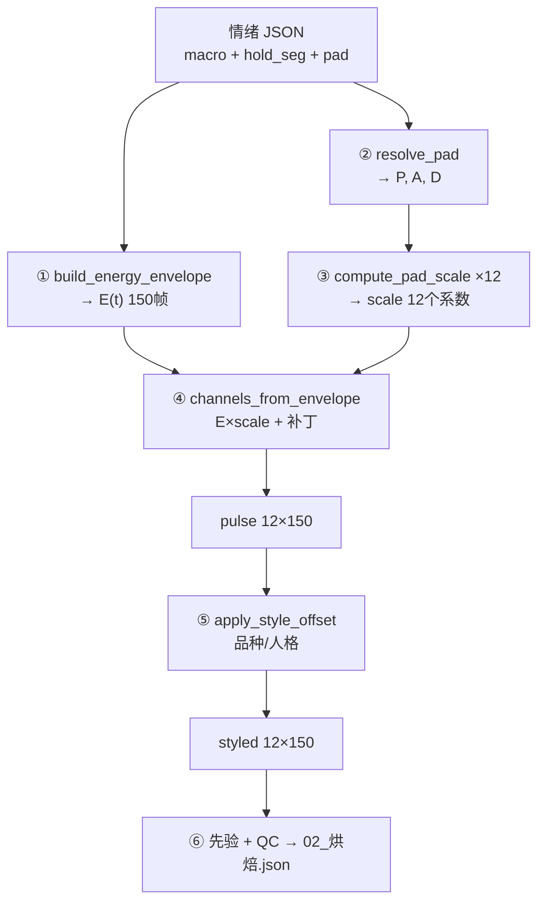

# 全流程与风格化 — 白话导读

> **状态：2026-05-30** · 本目录 = 管线 **`04_通道编译`**（含 S4→S5 串讲）  
> **读者**：第一次读管线、觉得 [`03_E(t)与PAD到十二通道原理.md`](03_E(t)与PAD到十二通道原理.md) 仍「云里雾里」的人  
> **目的**：用一条完整故事讲清 **转换 → 补丁 → 风格化**，以 **狗 · 委屈** 为例

**兄弟合同**（分工，本文不重复公式全文）：

| 文件 | 只管 |
|------|------|
| [`../02_情绪与能量/macro到下游白话导读.md`](../02_情绪与能量/macro到下游白话导读.md) | **macro→E(t)→下游**（还没搞懂滑杆时先读） |
| [`03_E(t)与PAD到十二通道原理.md`](03_E(t)与PAD到十二通道原理.md) | S4 公式、决策记录、代码入口 |
| [`05_完整演算样例_委屈×巨贵.md`](05_完整演算样例_委屈×巨贵.md) | **逐步算数**（委屈 v3.2 × 巨贵，含 t=80 全通道） |
| [`00_通道编译导读.md`](00_通道编译导读.md) | 四层数据形状、S4 边界 |
| [`01_十二通道与全量帧格式.md`](01_十二通道与全量帧格式.md) | 12 通道名单、02 JSON 格式 |
| 合同 `05_风格化/` | 品种/人格 base_offset、scale_factor 审定 |

**代码真源（狗为例）**：

| 步骤 | 文件 | 函数 |
|------|------|------|
| E(t) | `gaze_engine/_shared/envelope_compile.py` | `build_energy_envelope()` |
| PAD → scale | 同上 + `gaze_engine/dog/pad_weights.py` | `compute_pad_scale()` |
| E×PAD + 补丁 → pulse | `gaze_engine/dog/envelope_compile.py` | `channels_from_envelope()` |
| pulse → styled | `gaze_engine/_shared/style_compose.py` | `apply_style_offset()` |

---

## 一、先记住一张「数据形状表」

| 阶段 | 是什么 | 形状 | 类比 |
|------|--------|------|------|
| 输入 | 6 根 macro + hold_seg | 滑杆 | 导演说：「第几秒起峰、盯住多久、保持段抖不抖」 |
| 输入 | PAD (P, A, D) | 3 个数 | 化妆师说：「这张脸偏委屈、偏静、偏退缩」 |
| **S4 中间** | E(t) | **1 条 × 150 帧** | **总音量曲线**：5 秒内多用力 |
| **S4 中间** | scale | **12 个数**（每通道一个，不随时间变） | **12 个通道的性格旋钮** |
| **S4 输出** | pulse | **12 条 × 150 帧** | 情绪表演本身 |
| **S5 输出** | styled | **12 条 × 150 帧** | 同一表演，换品种/人格后的「长相偏移」 |

**三个常见误解**：

- ❌ 不是「6 根 macro + 3 个 PAD = 12 通道」
- ❌ 不是「PAD 有 12 维」
- ✅ 是：**1 条时间曲线 × 12 个静态系数 → 12 条波形，再按规则打补丁**

---

## 二、整条管线（从 JSON 到最终动画数）

```text
情绪 JSON（macro / hold_seg / pad）
        │
        ├─► ① build_energy_envelope()     →  E[0..149]        （1 条）
        │
        └─► ② resolve_pad()               →  P, A, D          （3 个数）
                    │
                    ▼
            ③ compute_pad_scale() ×12     →  scale[ch]       （12 个系数）
                    │
                    ▼
            ④ channels_from_envelope()      →  pulse[ch][t]    （12×150）
                    │
                    ├─► inject_ear（猫狗）
                    ├─► tremble / 委屈湿眼等补丁
                    └─► micro_jitter 微颤
                    │
                    ▼
            ⑤ apply_style_offset()          →  styled[ch][t]    （12×150）
                    │
                    ▼
            ⑥ 先验 + QC → 02_烘焙_*.json
```



**S4 管「怎么演」；S5 管「谁的脸在演」。**  
品种/人格 **不改 E(t)**，只改 12 通道数值的偏移和缩放。

---

## 三、第一步：macro → E(t) ——「5 秒的总音量」

6 根滑杆 + hold_seg 合成 **唯一一条** 能量曲线：

```text
帧 0──────蓄力──────启动──────保持──────缓和──────帧 149
E(t):  0.1 → 0.3 → 0.8(峰) → 0.6(平/颤) → 0.2
```

- 只管 **时间**：何时蓄力、何时到顶、盯住段平还是颤、怎么收
- **不管** 委屈还是愤怒的脸型差异
- 门户脉冲图 ≈ 这条线的可视化

---

## 四、第二步：PAD → 12 个 scale ——「12 路各自开多大」

3 个气质数 **不直接变成动画**，先投影成 12 个 **静态系数**（整段 5 秒不变）：

```text
scale[ch] = base[ch] + P×Wp[ch] + A×Wa[ch] + D×Wd[ch]
scale[ch] = max(0, scale[ch])
```

**举例（狗 · squint 通道）**：

```text
Wp=0.10, Wa=0.35, Wd=0.20, base=0.31
委屈 PAD = (P=-0.35, A=0.25, D=-0.55)

scale[squint] = 0.31 + (-0.35×0.10) + (0.25×0.35) + (-0.55×0.20)
              ≈ 0.25
```

同一种 PAD 下：

- `squint` 的 scale ≈ **0.25**（眯眼通道偏开）
- `eye_gloss` 的 scale ≈ **0.14**（高光通道偏弱）

**因为权重表 `DOG_PAD_WEIGHTS` 里每路 Wp/Wa/Wd 不同。**

---

## 五、第三步：E(t) × scale → pulse ——「逐帧相乘 + 补丁」

### 5.1 默认规则（大多数通道）

```text
pulse[ch, t] = clamp( E[t - lag[ch]] × scale[ch] × gain[ch] , 0, 1 )
```

| 符号 | 含义 |
|------|------|
| `E(t)` | 这一帧有多用力 |
| `scale[ch]` | 这路通道对 PAD 的响应强度 |
| `lag[ch]` | 该通道比 E(t) 晚几帧启动，避免 12 轨同步拉伸 |
| `gain[ch]` | 该通道额外倍率 |

**心算例子**（t=80，保持段，E(80)=0.6）：

```text
pulse[squint, 80]   ≈ 0.6 × 0.25 × 1.10 ≈ 0.17   （还没算补丁）
pulse[eye_gloss, 80]≈ 0.6 × 0.14 × 0.42 ≈ 0.04
```

同一时刻 E 相同，12 路值不同 —— 因为 scale、gain、lag 各不同。

### 5.2 补丁 ——「不能只用 E×scale 的特殊情况」

补丁 **不是另一步**，是在 `channels_from_envelope()` **内部**，算完默认公式后再 **叠加或替换**：

| 补丁 | 干什么 | 为什么单独做 |
|------|--------|--------------|
| **blink** | 在 t_peak、保持段等时刻插入快闭快开 spike | 眨眼是离散事件，不是随 E 平滑升降 |
| **pupil_x / pupil_y** | 加视线方向偏置 | 有左右/上下，不只是强度 |
| **inject_ear**（猫狗） | 往 eyebrow/brow_raise 槽位写耳位 | 狗没有「眉」，槽位复用 |
| **委屈湿眼** | 保持段叠加眯眼 + 高光基线 | 委屈的「湿眼」是静态气质，不是 E 乘出来的 |
| **tremble 保持段** | 各通道不同幅度 ripple | hold_seg=tremble 时的颤抖花纹 |
| **micro_jitter** | 全段微颤 | 生物感，最后叠一层 |

可以把 pulse 想成：

```text
pulse = (E × scale 的默认形) + 例外通道替换 + 情绪补丁 + 微颤
```

**委屈·狗在保持段**，squint 还会被 `_apply_moist_sad_baseline` **再加** 约 0.07~0.12，所以比纯 E×scale 更眯、更湿。

### 5.3 一张心算图（委屈·狗 · t=80）

```text
时刻 t=80（保持段中段），E(80)=0.6

PAD 委屈 (-0.35, 0.25, -0.55)
  → scale[squint]≈0.25, scale[eye_gloss]≈0.14, ...

pulse[squint, 80]   ≈ E(80) × 0.25 × gain + tremble补丁 + 委屈湿眼基线
pulse[eye_gloss, 80]≈ E(80) × 0.14 × gain + 湿眼基线
pulse[blink, 80]    ≈ 若 t=80 附近有眨眼锚点则 spike，否则≈0
```

---

## 六、第四步：风格化 S5 ——「同一段表演，换一张脸」

S4 的 pulse 是 **情绪 + 节拍** 的纯表演。S5 叠 **品种/人格**：

```text
styled[ch, t] = clamp01( base_offset[ch] + scale_factor[ch] × pulse[ch, t] )
```

| | pulse | styled |
|--|-------|--------|
| 决定因素 | 情绪 PAD + macro 节拍 | 品种 JSON（如哈士奇 vs 吉娃娃） |
| 是否改 E(t) | — | **不改** |
| 效果 | 委屈怎么演 | 大眼睛品种 vs 小眼睛品种 |

**举例**：pulse 的 squint 在 t=80 是 0.25；哈士奇 `base_offset[squint]=0.05`、吉娃娃 `=0.12` → styled 整体抬高，但 **时间形状仍跟 pulse 走**。

代码：`gaze_engine/_shared/style_compose.py` → `apply_style_offset()`

---

## 七、用「调音台 + 化妆 + 品种滤镜」串起来

```text
① 导演（macro）     → 推总音量推子 E(t)，5 秒内起伏
② 化妆师（PAD）     → 给 12 路各设一个「性格旋钮」scale[12]
③ 调音师（S4）      → 每帧：音量 × 旋钮 → 12 路波形
                      眨眼单独插 spike、委屈加湿眼、颤抖加 ripple
④ 品种滤镜（S5）    → 每路整体抬高/缩小，不换导演稿
⑤ 质检（S6）        → 写入 02_烘焙.json → 渲染 MP4
```

---

## 八、三个最容易混的概念

### 8.1 scale vs pulse

| | scale | pulse |
|--|-------|-------|
| 个数 | 12 个 **常数** | 12×150 **随时间变** |
| 来源 | PAD 展开 | E(t) 驱动 + 补丁 |

### 8.2 补丁 vs 风格化

| | 补丁（S4 内） | 风格化（S5） |
|--|---------------|--------------|
| 改什么 | blink / 湿眼 / tremble 等 **生理/表演规则** | 品种/人格 **长相偏移** |
| 换情绪 | 会变 | 不变（同一品种矩阵） |
| 换品种 | 不变 E(t)，pulse 也不因品种变 | styled 会变 |

### 8.3 eyebrow 在狗身上

- 通道名仍叫 `eyebrow`，语义是 **耳位**，由 `inject_ear` 注入，不是人类眉毛

---

## 九、对着代码走一遍（推荐顺序）

1. `gaze_engine/_shared/envelope_compile.py` → `build_energy_envelope()`  
2. 同上 → `compute_pad_scale()`  
3. `gaze_engine/dog/envelope_compile.py` → `channels_from_envelope()`  
   - 重点看：`_dog_blink_series`、`_apply_moist_sad_baseline`、`_apply_tremble_hold_coupling`  
4. `gaze_engine/_shared/style_compose.py` → `apply_style_offset()`

---

## 十、检查点（自测）

- [ ] 能说出：**E(t) 1 条，PAD 3 个数，scale 12 个常数，pulse 12×150**
- [ ] 能说出：**默认形 = E(t) × scale[ch]；blink 等是例外**
- [ ] 能说出：**补丁在 S4 内，风格化在 S5，品种不改 E(t)**
- [ ] 能区分：**scale（静态系数）vs pulse（动态曲线）vs styled（加品种偏移）**

---

## 修改记录

| 日期 | 改了什么 | 原因 |
|------|----------|------|
| 2026-05-30 | 初版 | 补 S4→S5 串讲白话，便于第一次读管线的人对照 |

---

**一句话**：

> **E(t) 是 5 秒总音量；PAD 展开成 12 个通道系数；默认每帧 = E×系数；blink/湿眼/颤抖等是补丁；pulse 再经品种 base+scale 变成 styled。**
